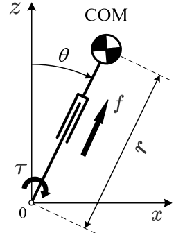
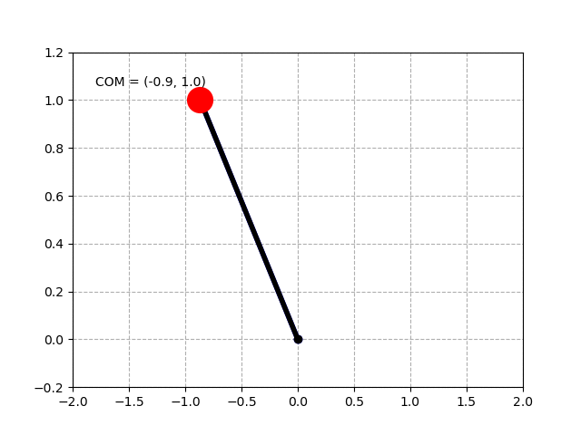
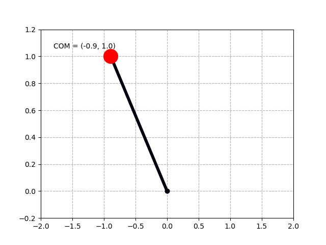
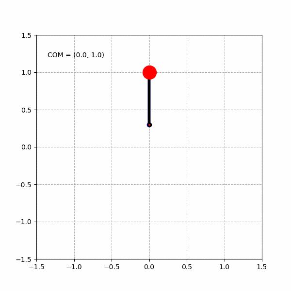
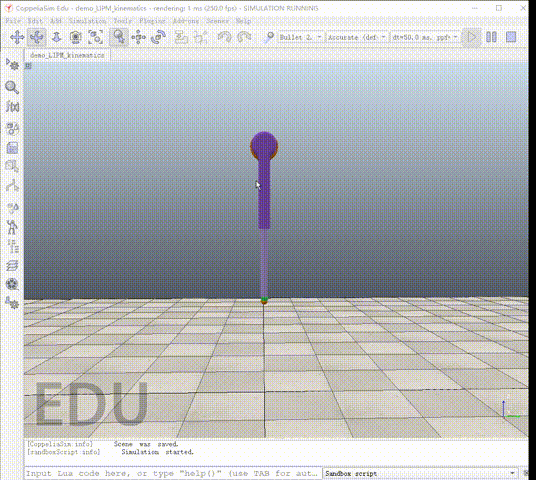
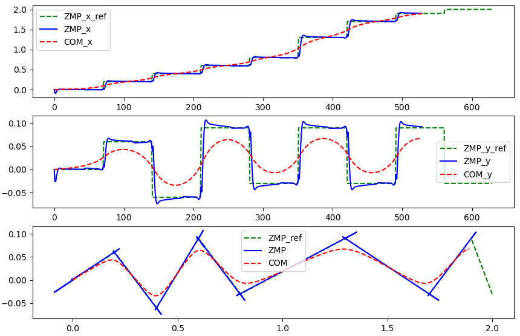

# Bipedal Walking Robots

---

Required enverionments:

- Python 3.6 +
- CoppeliaSim 4.0 +

---
## 1. Basic computation of 2D LIPM

This project is about the models and algorithms for bipedal walking control, including the Linear Inverted Pendunum Model (LIPM) and humandoid robots. The LIPM is shown as follows:

The calculation for LIPM is implemented with Python 3.6, given different target orbital energy, the LIPM can be controlled to different walking states.

### 1.1 Single leg

1.1 Giving a initial state for a positve orbital energy.

1.2 Giving a initial state for a negetive orbital energy.

### 1.2 Double legs

1.2.1 Giving a zero target orbital energy.

1.2.2 Giving a positive target orbital energy.

1.2.3 Giving a negetive target orbital energy.

---

## 2. Forward kinematics and inverse kinematics

### 2.1  Plot with python

Run the script in 'LIPM/LIPM_ik_test.py', you can get the following result:

### 2.2 Plot with VREP (CoppliaSim)

Open 'scenes/demo_1_LIPM_kinematics.ttt' with CoppliaSim 4.0+ and run the project with the begin button of CoppeliaSim , then run with the script 'demo_1_LIPM_kinematics.py', you can get the following result:

## 3. 3D LIPM model

Run the script in 'LIPM/demo_LIPM_3D.py', and specify different parameters, you can get different simulation results.

Walk forward:

Turn left:

Turn right:

---

## 4.ZMP preview control

The code is opensource at: https://github.com/chauby/ZMP_preview_control

Tutorial: https://zhuanlan.zhihu.com/p/452704228?

The ZMP and COM trajectory generation with the given ZMP stepping positions:

---

## 文章教程

代码对应的文章教程有两种访问方式，详见：

1. 知乎专栏：https://www.zhihu.com/column/c_1212783320150577152

2. 微信公众号：沙漏AI机器人。

    

获取《仿人机器人》中文版书籍，可关注公众号后，在后台回复【HR】获取下载链接。
